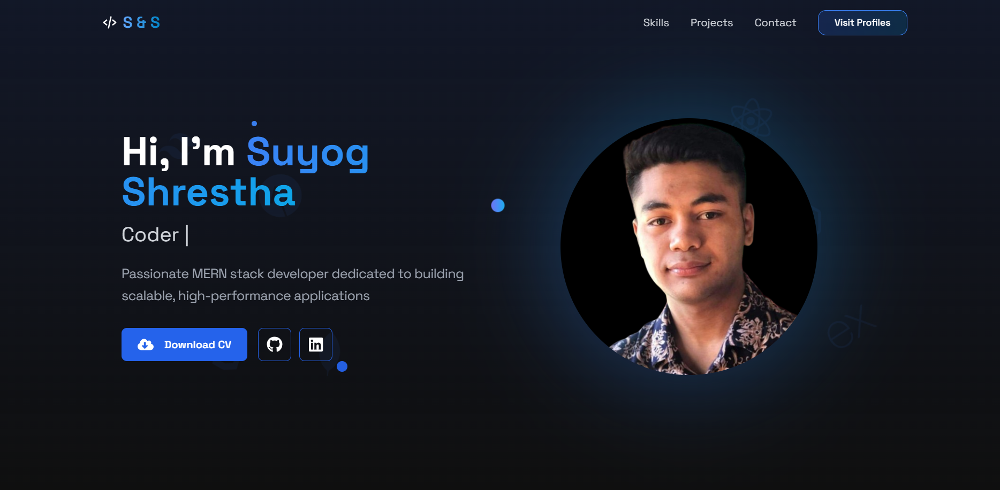

# 🚀 My React Portfolio

  
[🔗 Live Demo](https://suystha7.vercel.app/)

## 📌 Overview

This is my personal **React Portfolio** showcasing my skills, projects, and experience. It features a modern UI/UX, smooth animations, and fully responsive design, ensuring seamless performance across all devices.

## 🌟 Features

✅ **Responsive Design** – Works flawlessly on all screen sizes.  
✅ **Animated Cursor** – Custom gradient animated cursor effect.  
✅ **Smooth Scroll Navigation** – Effortless scrolling experience.  
✅ **React Suspense and Lazy Loading** – Efficiently loads components only when needed.  
✅ **Optimized Performance** – Built with modern React best practices.

---

## 🛠️ Tech Stack & Tools

| Technology                  | Description                             |
| --------------------------- | --------------------------------------- |
| **Vite + React**            | Fast and efficient frontend development |
| **Tailwind CSS**            | Utility-first styling framework         |
| **Framer Motion**           | Smooth and engaging animations          |
| **React Scroll**            | Section-based navigation                |
| **React Icons**             | Stylish icons for UI components         |
| **React Custom Scrollbars** | Enhanced scrollbar customization        |

---

## 📂 Project Structure

```
react-portfolio/
├─ index.html
├─ package-lock.json
├─ package.json
├─ postcss.config.js
├─ public/
│  ├─ profile.png
│  └─ vite.svg
├─ README.md
├─ src/
│  ├─ App.jsx
│  ├─ assets
│  ├─ components/
│  │  ├─ CodingStats.jsx
│  │  ├─ Contact.jsx
│  │  ├─ Cursor.jsx
│  │  ├─ Experience.jsx
│  │  ├─ Footer.jsx
│  │  ├─ Hero.jsx
│  │  ├─ Loading.jsx
│  │  ├─ Navbar.jsx
│  │  ├─ Portfolio.jsx
│  │  ├─ Reveal.jsx
│  │  ├─ ShinyEffect.jsx
│  │  └─ Skills.jsx
│  ├─ index.css
│  └─ main.jsx
├─ tailwind.config.js
└─ vite.config.js

```

---

## 🚀 Getting Started

### 1️⃣ Clone the Repository

```sh
git clone https://github.com/suystha7/Portfolio.git
cd react-portfolio
```

### 2️⃣ Install Dependencies

```sh
npm install
```

### 3️⃣ Run the Project (Vite)

```sh
npm run dev
```

The project will be available at **[http://localhost:5173](http://localhost:5173)**

---

## 📦 Installed Dependencies

```json
"dependencies": {
  "framer-motion": "^10.0.0",
  "react": "^18.2.0",
  "react-custom-scrollbars-2": "^5.0.0",
  "react-icons": "^5.0.0",
  "react-router-dom": "^6.0.0",
  "react-scroll": "^1.8.0"
}
```

## 🛠️ Functionality Breakdown

- **Navbar** – Responsive navigation with smooth scrolling.
- **Hero Section** – Stunning intro with animations.
- **Portfolio Section** – Showcases projects dynamically.
- **Custom Cursor** – Gradient animated cursor for a unique feel.
- **Smooth Scrolling** – Implemented via `react-scroll`.

---

## 🌎 Deployment

To deploy the project, run:

```sh
npm run build
```

Then upload the `dist/` folder to **cPanel, Vercel, Netlify, or GitHub Pages**.

### Deploy on Vercel

```sh
vercel deploy --prod
```

### Deploy on Netlify

```sh
netlify deploy --prod
```

---

## 📬 Contact Me

💼 **Portfolio:** [Suyog Shrestha](https://suystha7.vercel.app/)  
🐙 **GitHub:** [suystha7](https://github.com/suystha7)  
📧 **Email:** [suyogstha317@gmail.com](mailto:suyogstha317@gmail.com)

🚀 Feel free to contribute, raise issues, or suggest improvements! 💡
